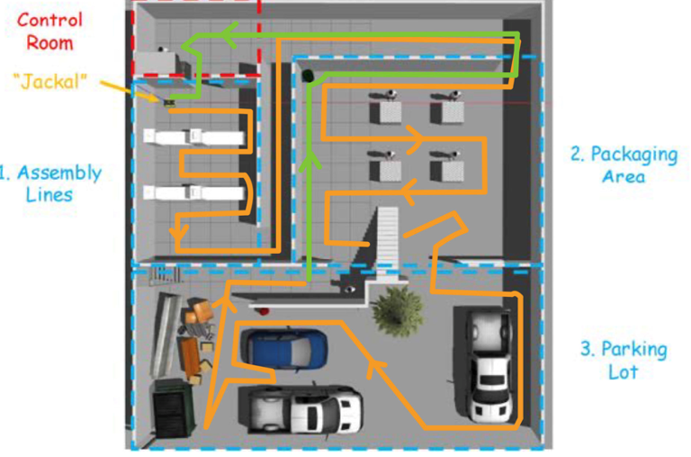
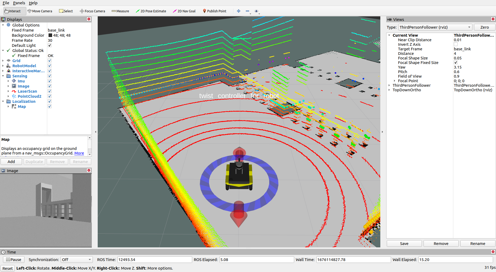
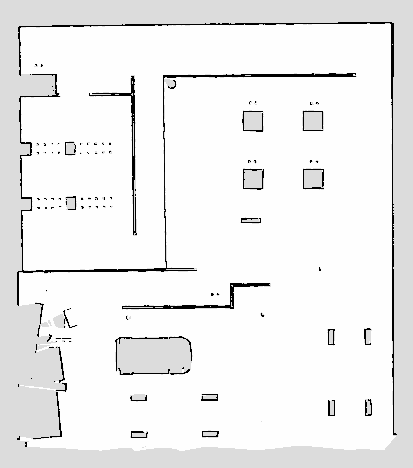
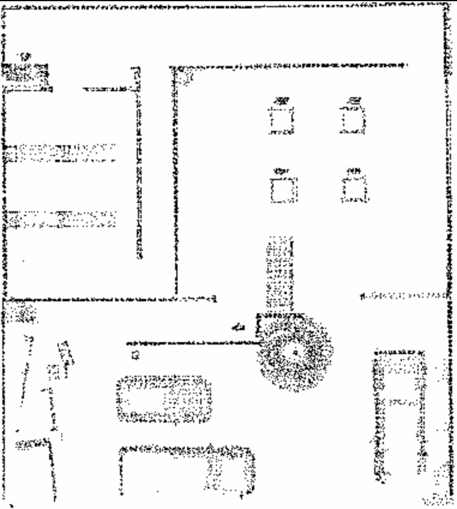
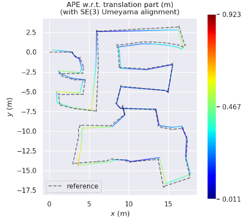
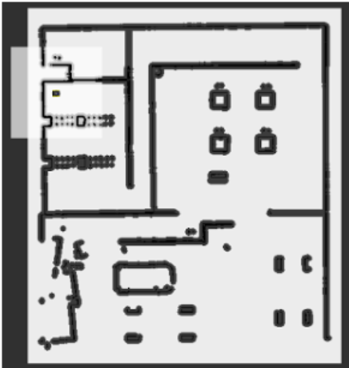
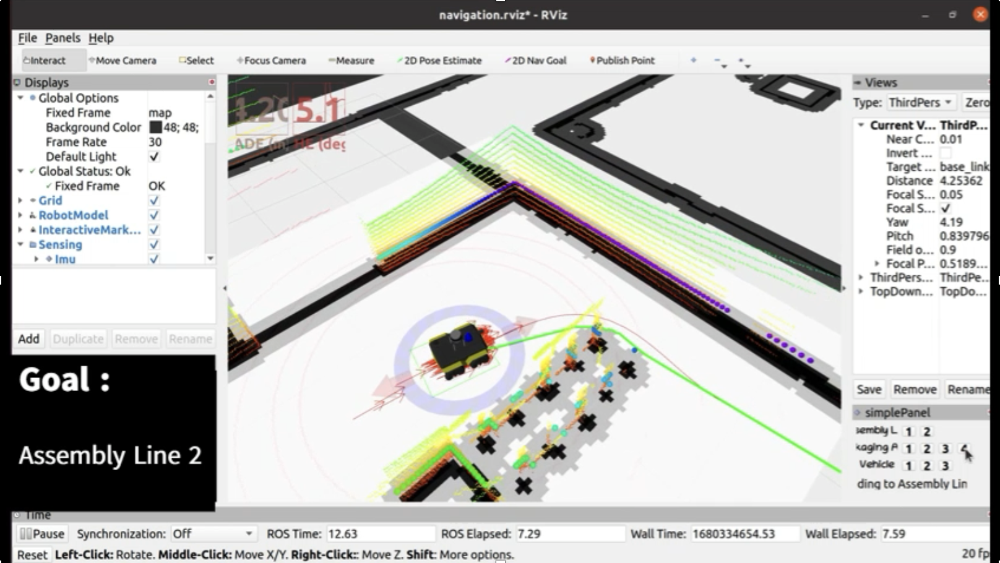

# NUS ME5413 Autonomous Mobile Robotics Final Project
> Authors: Christina Lee, Dongen Li, Yuhang Han, and Shuo Sun


 


## Dependencies

* System Requirements:
  * Ubuntu 20.04 (18.04 not yet tested)
  * ROS Noetic (Melodic not yet tested)
  * C++11 and above
  * CMake: 3.0.2 and above
* This repo depends on the following standard ROS pkgs:
  * `roscpp`
  * `rospy`
  * `rviz`
  * `std_msgs`
  * `nav_msgs`
  * `geometry_msgs`
  * `visualization_msgs`
  * `tf2`
  * `tf2_ros`
  * `tf2_geometry_msgs`
  * `pluginlib`
  * `map_server`
  * `gazebo_ros`
  * `jsk_rviz_plugins`
  * `jackal_gazebo`
  * `jackal_navigation`
  * `velodyne_simulator`
  * `teleop_twist_keyboard`
* And this [gazebo_model](https://github.com/osrf/gazebo_models) repositiory

## Installation

This repo is a ros workspace, containing three rospkgs:

* `interactive_tools` are customized tools to interact with gazebo and your robot
* `jackal_description` contains the modified jackal robot model descriptions
* `me5413_world` the main pkg containing the gazebo world, and the launch files

**Note:** If you are working on this project, it is encouraged to fork this repository and work on your own fork!

After forking this repo to your own github:

```bash
# Clone your own fork of this repo (assuming home here `~/`)
cd
git clone https://github.com/<YOUR_GITHUB_USERNAME>/ME5413_Final_Project.git
cd ME5413_Final_Project

# Install all dependencies
rosdep install --from-paths src --ignore-src -r -y

# Build
catkin_make
# Source 
source devel/setup.bash
```

To properly load the gazebo world, you will need to have the necessary model files in the `~/.gazebo/models/` directory.

There are two sources of models needed:

* [Gazebo official models](https://github.com/osrf/gazebo_models)
  
  ```bash
  # Create the destination directory
  cd
  mkdir -p .gazebo/models

  # Clone the official gazebo models repo (assuming home here `~/`)
  git clone https://github.com/osrf/gazebo_models.git

  # Copy the models into the `~/.gazebo/models` directory
  cp -r ~/gazebo_models/* ~/.gazebo/models
  ```

* [Our customized models](https://github.com/NUS-Advanced-Robotics-Centre/ME5413_Final_Project/tree/main/src/me5413_world/models)

  ```bash
  # Copy the customized models into the `~/.gazebo/models` directory
  cp -r ~/ME5413_Final_Project/src/me5413_world/models/* ~/.gazebo/models
  ```
 

If you have installed all of the tools, you can go to the next step: Usage. 

## Usage

### 0. Gazebo World

This command will launch the gazebo with the project world

```bash
# Launch Gazebo World together with our robot
roslaunch me5413_world world.launch
```

### 1. Manual Control

If you wish to explore the gazebo world a bit, we provide you a way to manually control the robot around:

```bash
# Only launch the robot keyboard teleop control
roslaunch me5413_world manual.launch
```

**Note:** This robot keyboard teleop control is also included in all other launch files, so you don't need to launch this when you do mapping or navigation.


### 2. Mapping

After launching **Step 0**, in the second terminal:

```bash
# Launch GMapping
roslaunch me5413_world mapping.launch
```

After finishing mapping, run the following command in the thrid terminal to save the map:

```bash
# Save the map as `my_map` in the `maps/` folder
roscd me5413_world/maps/
rosrun map_server map_saver -f my_map map:=/map
```


 

by the way you can obtain the global map by 3D Lidar SLAM like below and also a corresponding .yaml file， rename both as my_map and put them into `src/me5413_world/maps/`




Finally you need to evaluate your map by EVO


### 3. Navigation

Once completed **Step 2** mapping and saved your map, quit the mapping process.

Then, in the second terminal:

```bash
# Load a map and launch AMCL localizer
roslaunch me5413_world navigation.launch
```
### 3.2  Modify the AMCL params for better result

#### a)  Find the file: ‘acml.launch’ in the ‘$(find jackel_navigation)/launch/include’, copy it into the ‘~/ME5413_Final_Project/src/me5413_world/launch’.

#### b)  Modify the params, the attach code is our params had modified:
```
```
Of course, you can modify the params to adjust your map and robot.  

### 3.3   Compiling Costmap_Prohibiton_Layer

#### a)     Find the two files: ‘global_costmap_params.yaml’ and ‘local_costmap_params.yaml’ in the ‘$(find jackal_navigation)/params/map_nav_params’. You can copy the folder ’params’ into the folder ‘ME5413_Final_Project’.

Adding the following code in two ‘.yaml’:

```
# plugins:

      {name: static_layer, type: “costmap_2d::StaticLayer”}
      {name: obstacles_layer, type: “costmap_2d::ObstacleLayer”}
        #added code
      {name:costmap_prohibition_layer, type: “costmap_prohibition_layer_namespace::CostmapProhibitionLayer”}
        #
      {name: inflater_layer, type: “costmap_2d::InflationLayer”}
```

#### b)     Modifying the ‘move_base.launch’ in the folder ‘~/ME5413_Final_Project/params’:
Adding the following code in the launch:
```
<!-- added code -->
<rosparam file=” ~/ME5413_Final_Project/params/map_nav_params/prohibition_areas.yaml” command=”load” ns=”global_costmap/costmap_prohibition_layer” />
<rosparam file=” ~/ME5413_Final_Project/params/map_nav_params/prohibition_areas.yaml” command=”load” ns=”local_costmap/costmap_prohibition_layer” />
<!-- ------ -->
```

#### c)     Create a new .yaml file named ‘prohibition_areas’ in the folder ‘ME5413_Final_project/params’, keep the three .yaml file (global_costmap_params.yaml, local_costmap_params.yaml and prohition_areas.yaml) in the same folder. And edit the prohibition_areas.yaml:
```
prohibition_areas:


**point**

[17.09, -6.38]


**line** 

[[8.33, 2.11],
[8.26, 5.11]]

area 

[[-11.15, -15.14],
[-12.35, -13.89],
[-10.05, -12.21]]
```
one [,] is a point for [x,y], you can measure the point what you want to create the prohibition area in your map, maybe you can use ‘publish point’ tool in the ROS Rviz, you can get the coordination at the bottom side.

### 3.2 Compiling the Teb-Local-Planner

#### a) Create a new .yaml file named teb_local_planner, you can get a tutorial:
```
git clone https://github.com/rst-tu-dortmund/teb_local_planner_tutorials.git
```

In the cfg folder, there are three kinds of robot you can choose. For the ME5413_Final_Project, you can choose carlike robot. Copy the teb_local_planner_param.yaml into the ‘~/params’.

#### b) Configurate the teb_local_planner_param.yaml as your situation. There are some important params which may influence your result:
param	impact	Our cfg
Allow_init_with_backwards_motion	Allow the robot plan the path with backwards motion initially	False
Max_vel_x	The max velocity of x axis	0.5
Max_vel_theta	The max angular velocity of z axiz	0.8
Min_turning_radius	The min turning radius of your robot	0.3

When we sought the best planner path, we found these four params were important for my robot. If we set ‘allow_init_with_backwards_motion’ True, the robot will turn around ceaselessly at the global point to adjust its orientation. 
Then the max_vel_x is an important param if you do not want your robot rush into the obstacles_layer or move like a turtle.
Max_vel_theta and min_turning_radius should be coadjust. If your max_vel_theta is low, your min_turning_radius should be tuned larger. Of course, when you tune the params, you should consider the robot condition.

our final navigation map as follow:




#### c) Modifying the move_base.launch file:
```
<node pkg=”move_base” type=”move_base” respawn=”false” name=”move_base” output=”screen”>
 …
<!-- added code -->
<param name=”base_local_planner” value=”teb_planner/TebLocalPlannerROS” />
<!-- added end -->
<remap from=”odom” to=”odometry/filtered” />
 …
```

After all of above, you have walked the path we have spent weeks on! Enjoy your journey.





 ### Install Cartographer

First, we need to install the wstool and rosdep in order to built Cartographer ROS, and install Ninja for faster builds.
On Ubuntu Focal with ROS Noetic use these commands to install the above tools:

```
sudo apt-get update
sudo apt-get install -y python3-wstool python3-rosdep ninja-build stow
```

After the tools are installed, create a new cartographer_ros workspace in ‘cartographer_ws’:

```
mkdir cartographer_ws //create a new folder named cartographer_ws
cd cartographer_ws
wstool init
wstool merge -t src https://raw.githubusercontent.com/cartographer-project/cartographer_ros/master/cartographer_ros.rosinstall
wstool update -t src
```

Now you need to install cartographer_ros’ dependencies. First, we use rosdep to install the required packages. 
The command ‘sudo rosdep init’ will print an error if you have already executed it since installing ROS. This error can be ignored.
If the command ‘rosdep install –from-paths src –ignore-src –rosdistro=${ROS_DISTRO} -y’ print the error: ‘
you can delete the line 46 of package.xml: ‘<depend>libabsl-dev</depend>’, the file is in ‘~/cartographer_ws/src/cartographer/’.
```
sudo rosdep init
rosdep update
rosdep install –from-paths src –ignore-src –rosdistro=${ROS_DISTRO} -y
```

Cartographer uses the abseil-cpp library that needs to be manually installed using this script:
```
src/cartographer/scripts/install_abseil.sh
```

Build and Install:
```
catkin_make_isolated –install –use-ninja
```

Now that **Cartographer and Cartographer’s ROS integration** are installed. When you want to run cartographer_ros, you might need to source your ROS environment by running source install_isolated/setup.bash first (replace bash with zsh if your shell is zsh).

### 2.2 Install teb_local_planner

First, we need to install the dependency:
```
rosdep install teb_local_planner
```

Then, we install the teb_local_planner ROS Package from the github:
```
git clone https://github.com/rst-tu-dortmund/teb_local_planner.git
```

After installing the package, you can move the folder into the ‘ME5413_Final_Project/src’, ‘ME5413_Final_Project’ is the ROS work space of this solution.

Build and Install:
```
catkin_make -DCATKIN_WHITELIST_PACKAGES=’teb_local_planner’
```

In the end, you can check the plugin of teb_local_planner compiled completely whether or not. Hope you can find the teb_local_planner!
```
source devel/setup.bash // In the ME5413_Final_Project
rospack plugins –attrib=plugin nav_core
```

### Install Costmap_Prohibition_Layer

For the ME5413_Final_Project, there are some areas which cannot be accessible or be detected by the optics sensor: the operation room and the glass wall(transparent). For these areas, we create an additional costmap to help the global planner while navigation.

First, we can install a plugin from http://github.com/rst-tu-dortmund/costmap_prohibition_layer :
```
git clone https://github.com/rst-tu-dortmund/teb_local_planner.git
```

After installing the package, you can move the folder into the ‘ME5413_Final_Project/src’, ‘ME5413_Final_Project’ is the ROS work space of this solution. And built the situation:
```
catkin_make // In the ME5413_Final_Project 
```

In the end, you can check the plugin of Costmap_Prohibition_Layer compiled completely whether or not. If you can find the Costmap_Prohibition_Layer, CONGRATULATION!
```
source devel/setup.bash // In the ME5413_Final_Project
rospack plugins –attrib=plugin costmap_2d
```
## Contribution

You are welcome contributing to this repo by opening a pull-request

We are following:

* [Google C++ Style Guide](https://google.github.io/styleguide/cppguide.html),
* [C++ Core Guidelines](https://isocpp.github.io/CppCoreGuidelines/CppCoreGuidelines#main),
* [ROS C++ Style Guide](http://wiki.ros.org/CppStyleGuide)

## License

The [ME5413_Final_Project](https://github.com/NUS-Advanced-Robotics-Centre/ME5413_Final_Project) is released under the [MIT License](https://github.com/NUS-Advanced-Robotics-Centre/ME5413_Final_Project/blob/main/LICENSE)
